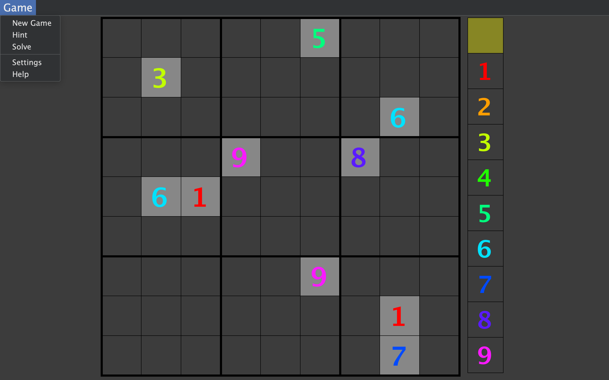

# Sudoku Solver & Generator

A customizable Sudoku game and solver built with **Java Swing** and designed to run on **Java 21**.

### ✨ Features

* **Customizable Board Size:** Create Sudoku puzzles of any dimension, from a standard 9x9 to more challenging sizes.

* **Adjustable Difficulty:** Control the number of pre-filled cells to create easier or harder puzzles.

* **Built-in Solver:** A feature to solve any valid Sudoku board. (See Performance Warning)

* **Hint** Reveals 1 random tile of the solution if the blank tile is selected or reveals 1 tile of the selected number

---

### ⚠️ Performance Warning

This application's solver is a simple backtracking algorithm with an exponential time complexity of approximately $O(n^m)$, where n is the number of possibilities for each cell and m is the number of cells. While it works well for standard 9x9 boards, it becomes significantly slower for larger grids.

**It is strongly recommended not to attempt to use the solve or hint feature on boards larger than 16x16 or start games with 1 or more pre-filled cells on a 16x16 game or larger.** This corresponds to a **Sudoku board size** setting of `4`, as shown in the screenshot below. The solver may take a very long time to find a solution or verify that one exists on larger boards.

---

### 💻 Prerequisites

* **Java Development Kit (JDK) 21** or later.

### ▶️ How to Run

This game is designed to be launched using your **GameLauncher** application.

1.  **Download via GameLauncher** Use the Browse tab of your GameLauncher to find and install the Sudoku game.
